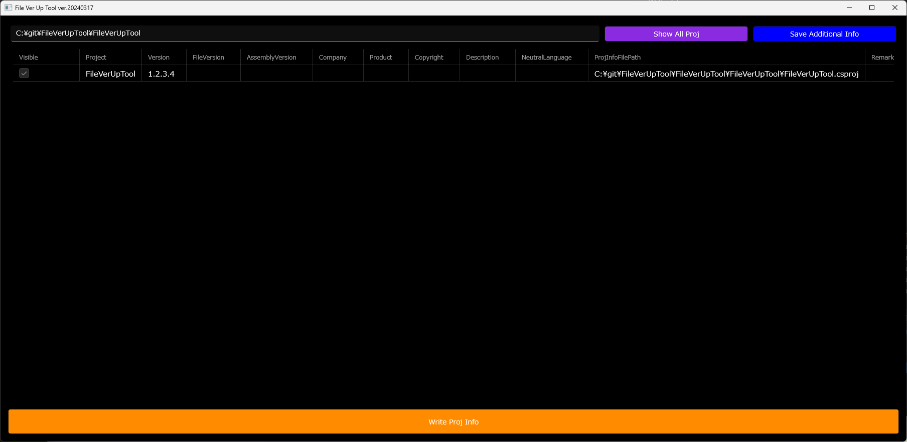

# FileVerUpTool

## 概要

複数プロジェクトを含むソリューションの「バージョン情報」や「付加情報」を一括で確認・編集・更新できるWindowsデスクトップアプリです。
リリース作業時のバージョン更新や、プロジェクトごとのメタ情報管理を効率化します。

## 主な機能

- 指定フォルダ配下のプロジェクト（.csproj, .rc, AssemblyInfo.cs, appxmanifest等）を自動検索
- 各プロジェクトのバージョンや付加情報（Visible/Remark等）をリスト表示
- リスト上での直接編集・一括編集
- 編集内容の一括保存（プロジェクトファイルへ反映）
- 付加情報の保存・読込（AdditionalData.txt）

## 使い方

1. アプリを起動
2. 一番上のテキストボックスに、対象フォルダのパスを入力
3. 「Read csproj」ボタンで情報を取得
4. リストで各プロジェクトの情報を確認・編集
   - ダブルクリックで個別編集
   - 画面下部の「Ikkatsu Settei」で一括編集
5. 編集後、「Write csproj」ボタンで保存
6. 付加情報は「付加情報保存」ボタンで保存・読込可能

## 対応ファイル

- .NET 5以降：`*.csproj`
- .NET Framework：`AssemblyInfo.cs`
- C++プロジェクト：`*.rc`
- UWP等：`Package.appxmanifest`

## 補足

- 付加情報は `AdditionalData.txt` として保存されます
- 編集内容は「Write csproj」ボタンで各プロジェクトファイルに反映されます

